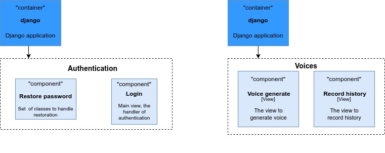
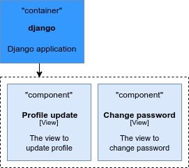
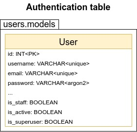
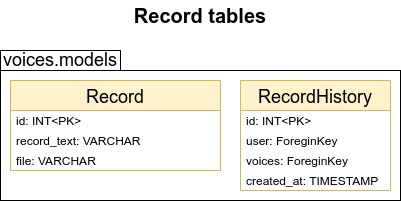

# UAVoiceGenerator

UAVoiceGenerator is a service that should allow users to generate ukrainian voice records from text.

## **Technologies stack:** 
Backend:
* Django
* Django REST framework
* Celery
* Docker
* PostgreSQL
* Redis
* ElasticSearch

## **Components**



## **Tables**
  

## **Setup Instructions**

### Clone repository

```bash
git clone https://github.com/wartinich/UAVoiceGenerator.git
```

### Star Development Server

1) Create .env file at config directory
```dotenv
SECRET_KEY=jpqlaijfjmncbnsmn
DEBUG=True
DJANGO_LOG_LEVEL=INFO
CELERY_LOG_LEVEL=INFO
POSTGRES_NAME=postgres
POSTGRES_USER=postgres
POSTGRES_PASSWORD=postgres
POSTGRES_HOST=localhost
POSTGRES_PORT=5432
CELERY_BROKER_URL=redis://redis:6379
CELERY_RESULT_BACKEND=redis://redis:6379
```
2) Start container
```bash
docker-compose --file docker-compose-dev.yml up
```
3) Create env
```bash
python -m venv env
```
4) Install requirements
```bash
cd src && pip install -r req.txt
```
5) Activate env
```bash
cd .. && source env/bin/activate
```
7) Start server
```bash
cd src && python manage.py runserver
```
8) Go to url address
```link
http://127.0.0.1:8000/
```


### Start Server

1) Create an image
```bash 
docker-compose build
```
2) Run container
```bash
docker-compose up
```
3) Go to url address
```link
http://127.0.0.1:8000/
```


